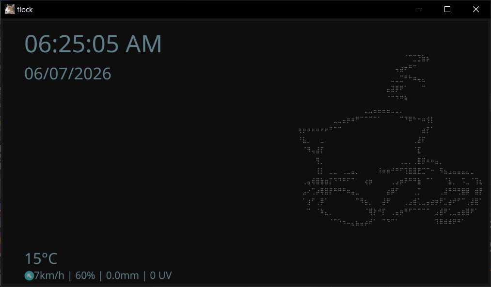

# flock

A simple cat clock desktop app built in Go using Fyne.



## Building from source

Make sure you have [Go](https://go.dev/dl/) installed (1.20 or newer is recommended).

Clone the repository and build the binary:

```bash
git clone https://github.com/lostdusty/flock.git
cd flock
go build
```

This will produce an executable in the project folder that you can run directly.

If you want to build using the Fyne toolkit's own build command instead:

```bash
go install fyne.io/fyne/v2/cmd/fyne@latest
fyne package -release
```

## Download for Windows

If you don't want to build the app yourself, you can download a ready-to-use Windows build from the [latest release](https://github.com/lostdusty/flock/releases/latest).

## License

This project is licensed under the MIT License. See the [LICENSE](LICENSE) file for details.
